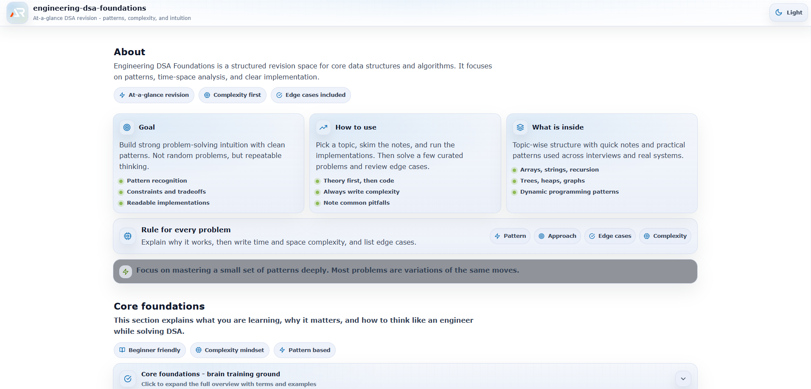

# Engineering DSA Foundations

A structured, engineering-focused deep dive into Data Structures and Algorithms.

This repository is not just a problem collection.  
It is a systematic breakdown of core algorithmic thinking, time-space analysis, and pattern recognition used in real software systems.---

---

---

## Purpose

- Build strong algorithmic intuition
- Master time and space complexity analysis
- Understand patterns behind common interview problems
- Develop problem-solving discipline
- Strengthen system-level thinking

This project focuses on clarity, depth, and structured learning rather than random problem solving.

---

## Structure

The repository is organized topic-wise for progressive learning.

01 - Time and Space Complexity  
02 - Arrays  
03 - Strings  
04 - Recursion  
05 - Linked List  
06 - Stack  
07 - Queue  
08 - Trees  
09 - Heap and Priority Queue  
10 - Graphs  
11 - Dynamic Programming

Each section includes:

- Theory explanation
- Implementation examples
- Edge case discussion
- Time complexity analysis
- Space complexity analysis
- Pattern breakdown

---

## Topics Covered

### 1. Time and Space Complexity

- Big O notation
- Best case, average case, worst case
- Amortized analysis

### 2. Arrays

- Prefix sum
- Sliding window
- Two pointers
- In-place modification patterns

### 3. Strings

- Pattern matching basics
- Frequency map logic
- Anagram detection
- Substring window techniques

### 4. Recursion

- Base case logic
- Call stack understanding
- Tail recursion
- Converting recursion to iteration

### 5. Linked List

- Reverse list
- Detect cycle using Floyd algorithm
- Merge sorted lists

### 6. Stack

- Balanced parentheses
- Monotonic stack
- Next greater element pattern

### 7. Queue

- Circular queue
- Deque
- BFS preparation

### 8. Trees

- Binary tree fundamentals
- Binary Search Tree operations
- Traversals: preorder, inorder, postorder
- Height and depth
- Lowest Common Ancestor

### 9. Heap and Priority Queue

- Min heap
- Max heap
- Heapify process
- Top K problems

### 10. Graphs

- Adjacency list representation
- BFS
- DFS
- Topological sort
- Dijkstra algorithm
- Cycle detection

### 11. Dynamic Programming

- Memoization
- Tabulation
- Knapsack
- Longest Increasing Subsequence
- State transition thinking

---

## Engineering Approach

Every problem in this repository follows a structured analysis:

1. Problem understanding
2. Naive solution
3. Optimized solution
4. Time complexity
5. Space complexity
6. Edge case handling
7. Why this approach works

The goal is not memorization.  
The goal is pattern recognition and structured reasoning.

---

## Tech Stack

- React + Vite
- JavaScript (ES6+)
- Structured folder architecture
- Deployed using GitHub Pages

---

## Deployment

Live site:

https://a2rp.github.io/engineering-dsa-foundations/

---

## Why This Repository Matters

Frameworks change.  
Algorithms remain.

Understanding DSA improves:

- Performance optimization
- Backend system efficiency
- Database query thinking
- Scalable architecture design
- Interview confidence

This repository is part of a long-term engineering foundation project.

---

## Status

Actively building and expanding.
